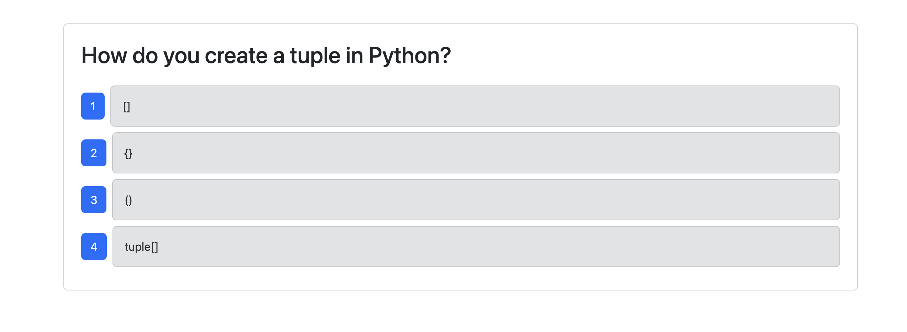
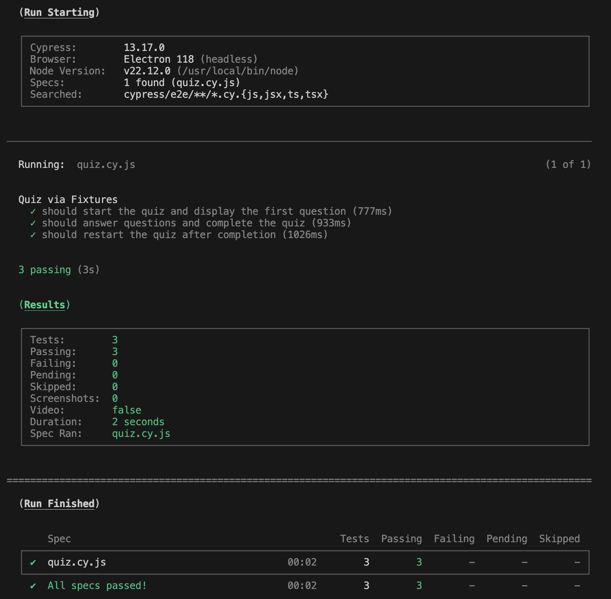
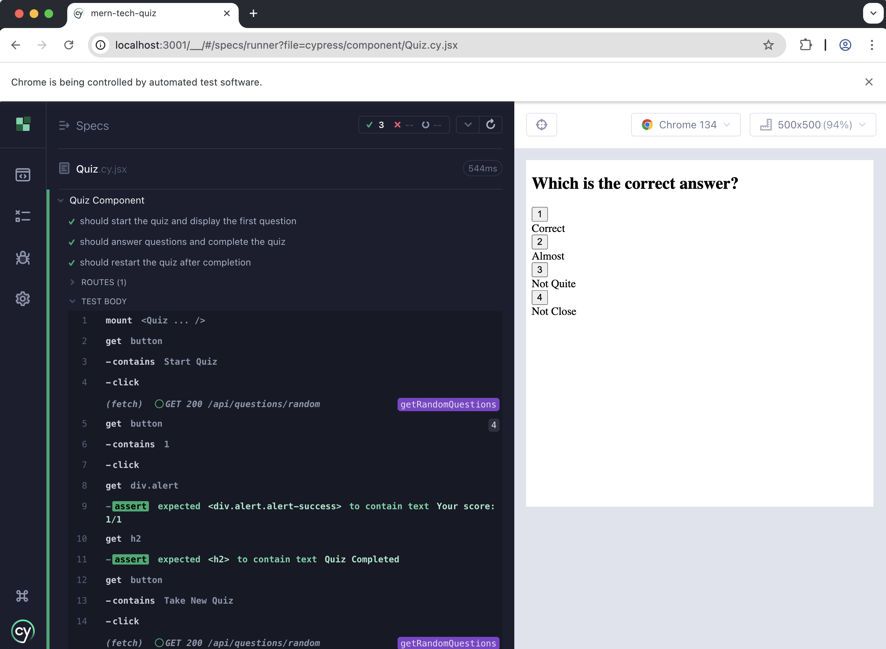

# Tech Quiz (MERN Stack)

## Description

This application serves as a platform for aspiring developers to test their knowledge and enhance their skills by completing a tech quiz. While I did not design the application itself, the primary focus of this project was to implement component tests and end-to-end tests using Cypress. Testing is a vital aspect of software development, ensuring code reliability and robustness. The tests created for this application evaluate server responses and assess the behavior of the Quiz component. Through this project, I gained valuable insights into the importance of integrating testing into the development process. Doing so streamlines the debugging process and allows us to have a greater understanding of our codebase.

## Table of Contents

- [Walkthrough Video](#walkthrough-video)
- [Installation](#installation)
- [Usage](#usage)
- [Tests](#tests)
- [Credits](#credits)
- [License](#license)
- [Questions](#questions)

## Walkthrough Video

https://www.loom.com/share/19ce21f6b29a4b0ca49cccc8e5c2c76a?sid=9258b4b6-0a7b-465f-b61d-f065b659e58f

## Installation

1. Navigate to the directory where you want to store the application.

2. Clone the repository to your local machine:

   ```sh
   git clone https://github.com/amelia1105/mern-tech-quiz.git
   ```

3. Navigate to the project directory:

   ```sh
   cd mern-tech-quiz
   ```

4. Install all required dependencies:

   ```sh
   npm install
   ```

## Usage
To use this application on your local machine, ensure you have a method to connect to a MongoDB database. Verify that the connection string in the `.env.EXAMPLE` file matches your MongoDB connection string.

1. Rename the `.env.EXAMPLE` file located in the server folder to `.env`.

2. Build the application:

   ```sh
   npm run build
   ```

3. Seed the database:

   ```sh
   npm run seed
   ```

4. Start the application:

   ```sh
   npm run start:dev
   ```

5. Once the application is running, click "Start Quiz" to begin. Answer the questions by clicking the blue buttons. Below is an example of a question you might see:

   

6. After completing the quiz, your score will be displayed. To retake the quiz, click "Take New Quiz." The questions are randomly generated, so you may encounter different questions each time you take the quiz.

## Tests

End-to-end and component tests were implemented for this application using Cypress to ensure its functionality and reliability.

### End-to-End Testing

1. Navigate to the `mern-tech-quiz` directory.

2. Follow the steps in the [Usage](#usage) section to start the server. Once the server is running, the application should automatically open, and the console will display the message: `API server running on port 3001!`.

3. Keep the server running, then open a new terminal window in the `mern-tech-quiz` directory. Run the following command:

   ```sh
   npm run test
   ```

   This command executes the end-to-end tests. Upon successful completion, you should see an output similar to the example below:

   

### Component Testing

1. Component testing does not require the server to be running. Navigate to the `mern-tech-quiz` directory and execute the following command:

   ```sh
   npm run cypress
   ```

2. A Cypress window will open. Select "Component" and choose a browser. Here, I use Chrome.

3. In the Cypress interface, select `Quiz.cy.jsx` to view the component tests. You can click on individual tests to observe their execution and results.

   

## Credits

The fully-functioning application, including all files within the client and server directories, was provided as part of the Rutgers University Coding Bootcamp Module 19 Challenge. You can find the original challenge details [here](https://bootcampspot.instructure.com/courses/6369/assignments/90367?module_item_id=1341605). The Cypress folder, along with its files, was provided by the instructor, Kevin Ferguson. This included the pre-configured `fixtures` and `support` folders, as well as the `tsconfig.json` file. While the `component` and `e2e` folders contained descriptions of the required tests, I wrote the actual tests. Additionally, I utilized GitHub Copilot to refine and enhance the code throughout the project.

## License

MIT License

Copyright (c) 2025 Amelia Alvarado

Permission is hereby granted, free of charge, to any person obtaining a copy
of this software and associated documentation files (the "Software"), to deal
in the Software without restriction, including without limitation the rights
to use, copy, modify, merge, publish, distribute, sublicense, and/or sell
copies of the Software, and to permit persons to whom the Software is
furnished to do so, subject to the following conditions:

The above copyright notice and this permission notice shall be included in all
copies or substantial portions of the Software.

THE SOFTWARE IS PROVIDED "AS IS", WITHOUT WARRANTY OF ANY KIND, EXPRESS OR
IMPLIED, INCLUDING BUT NOT LIMITED TO THE WARRANTIES OF MERCHANTABILITY,
FITNESS FOR A PARTICULAR PURPOSE AND NONINFRINGEMENT. IN NO EVENT SHALL THE
AUTHORS OR COPYRIGHT HOLDERS BE LIABLE FOR ANY CLAIM, DAMAGES OR OTHER
LIABILITY, WHETHER IN AN ACTION OF CONTRACT, TORT OR OTHERWISE, ARISING FROM,
OUT OF OR IN CONNECTION WITH THE SOFTWARE OR THE USE OR OTHER DEALINGS IN THE
SOFTWARE.


## Questions

For any questions about this project, please contact me by email: aebellanger@yahoo.com
